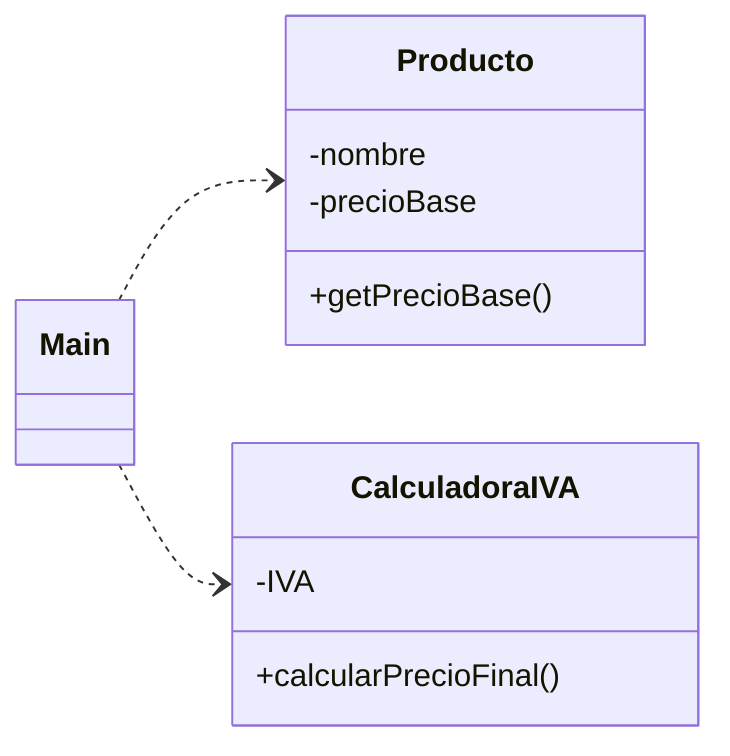

```mermaid
classDiagram
    direction LR
    Main ..> Producto
    Main ..> CalculadoraIVA

    class Producto {
        -nombre
        -precioBase
        +getPrecioBase()
    }

    class CalculadoraIVA {
        -IVA
        +calcularPrecioFinal()
    }
```
